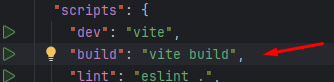
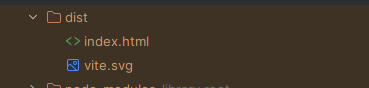
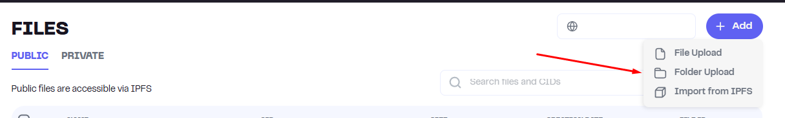
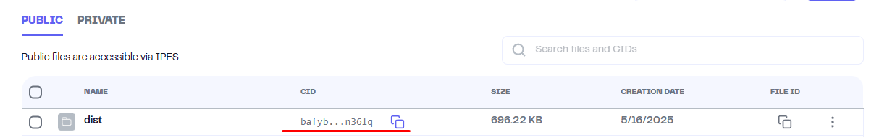

## Motivation

In today's digital landscape, where censorship and surveillance are on the rise, it's vital to have tools for **free, censorship-resistant, and anonymous publishing**. This project enables anyone to publish content — whether it's text, manifestos, ideas, or whistleblower reports — **without revealing their identity or relying on centralized platforms**.

We use **IPFS** (via [Pinata](https://www.pinata.cloud/)) for hosting content in a decentralized and persistent way. To enhance anonymity, we recommend using a **privacy-focused email provider** like [Tuta.io](https://tuta.io), especially when registering for services like Pinata. While it's not strictly required, we use it in our examples as a best practice for maintaining anonymity.

This project is a response to growing restrictions on the free flow of information. It empowers users to share ideas **beyond the reach of censorship**, while maintaining **control over their identity and data**.

## What Happens During IPFS Deployment (via Pinata)

When you deploy a file or folder to IPFS through Pinata:

1. **Content is hashed** — every file (or folder structure) is processed and a unique **CID** (Content Identifier) is generated based on its contents. If the content changes even slightly, the CID will change.

2. **Pinata uploads the content** to the IPFS network and **pins** it — meaning:
    - The content is stored on Pinata’s IPFS node.
    - It won’t be garbage-collected or lost, even if no one else is hosting it.

3. **The content becomes accessible** via any IPFS gateway (e.g., `ipfs.io`, `gateway.pinata.cloud`):
    - Example: `https://gateway.pinata.cloud/ipfs/Qm...`

4. **No central server is needed** — IPFS is a peer-to-peer network. Anyone with the CID can access or re-host the content.

5. **Optional replication** — If others re-pin or access the content, it can be cached or hosted on more nodes, increasing availability and redundancy.

This makes IPFS ideal for **censorship-resistant, permanent, and anonymous content publishing** — especially when combined with a trusted pinning service like Pinata.

## Steps to Host

1. Create an account on [Tuta](https://tuta.com/) for future use.  
   

2. Register a new account on [Pinata](https://pinata.cloud/) using the Tuta email.  
   

3. Generate a Pinata JWT token for GitHub Actions:
    - Go to the **Developer** → **API Keys** section.  
      
    - Click **New Key**, choose `pinFileToIPFS`, then click **Create**.
    - Copy the **JWT token** and paste it into your repository secrets under the name `PINATA_JWT`.  
        
      

## Coding Requirements Using React + Vite (If You Don’t Want to Fork This Repository)

1. Set up your fonts locally in the project.

2. Install the [vite-plugin-singlefile](https://github.com/richardtallent/vite-plugin-singlefile) and configure it in `vite.config.ts`.

### What the `vite-plugin-singlefile` Does:

- **Vite builds your app** as usual, splitting it into multiple JavaScript, CSS, and asset files.
- The plugin **post-processes the output** and:
    - Inlines all JavaScript and CSS into the final `index.html`.
    - Embeds images and fonts as Base64 (via data URLs), if configured.
- The result is a **fully self-contained `index.html`** file — no external file dependencies.

This makes the app:

- **Ideal for IPFS deployment**, since only one file (`index.html`) needs to be uploaded and pinned.
- **Resistant to broken paths or missing assets**, as everything is embedded.
- **Lightweight to share** — one CID, one link, fully functional SPA (Single Page Application).

This greatly simplifies hosting and ensures your app works anywhere — even opened directly from disk or via any IPFS gateway.

3. When a new pull request is created or changes are pushed, CI/CD actions will run automatically.  
   In the **Actions** tab, you'll see a new link to your deployed website.  
   

## Manual Deployment

1. Run the **build** command from `package.json`.  
   

2. The result will be a `dist` folder in the project root.  
   

3. Open your Pinata account and click the **Add** button in the top-right corner. Select **Folder Upload**.  
   

4. Upload your `dist` folder.

5. You will now see your uploaded folder with a generated CID.  
   

6. Done! Your site is available via its CID. You can open it with the following link format:  
   `https://<CID>.ipfs.dweb.link/`  
   Example:  
   `https://bafybeib3l2qzryxgjj5exwkdvugyle2koglkyn3fjexlonubqppfgn36lq.ipfs.dweb.link/`
