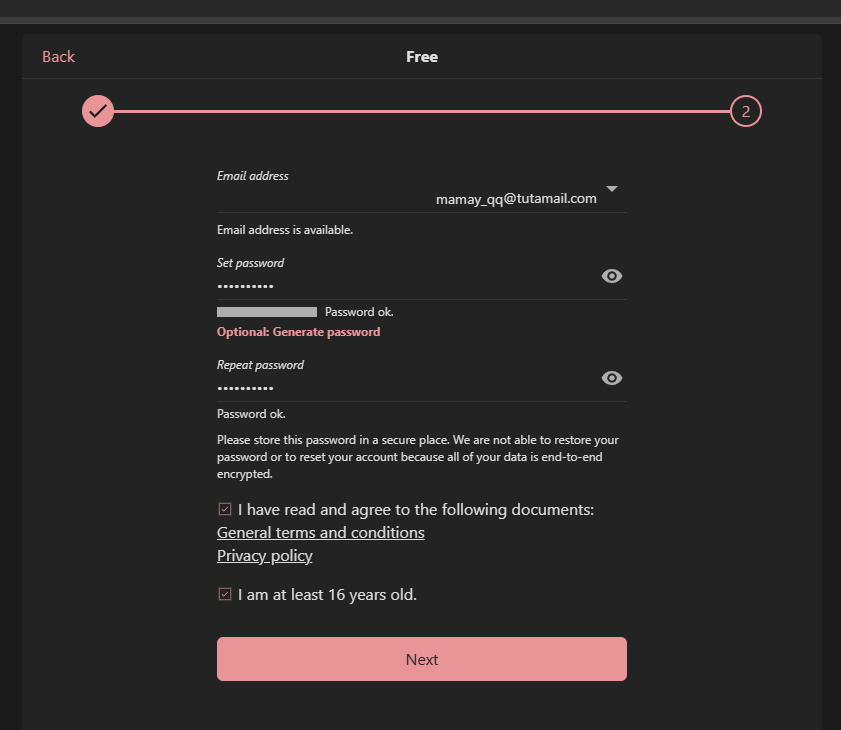
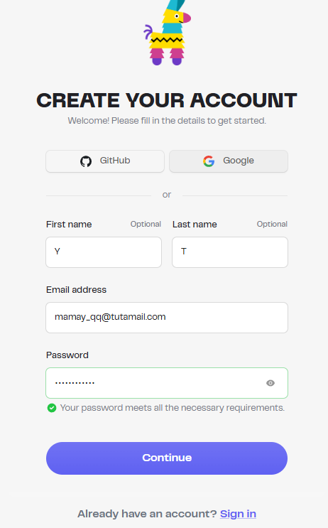
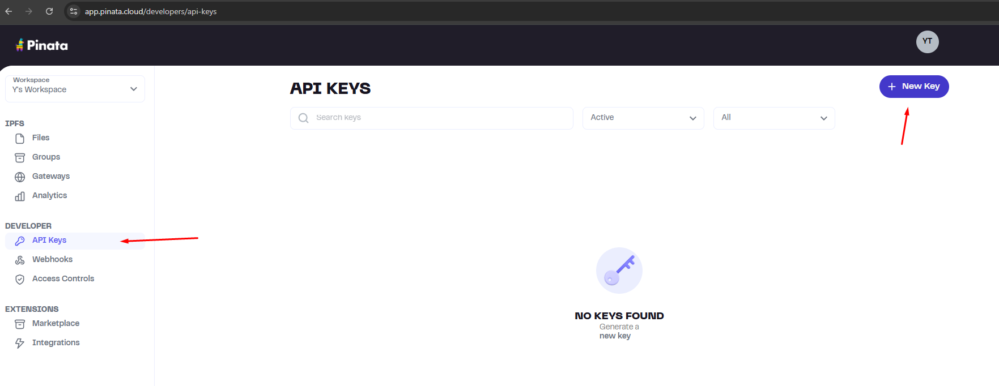
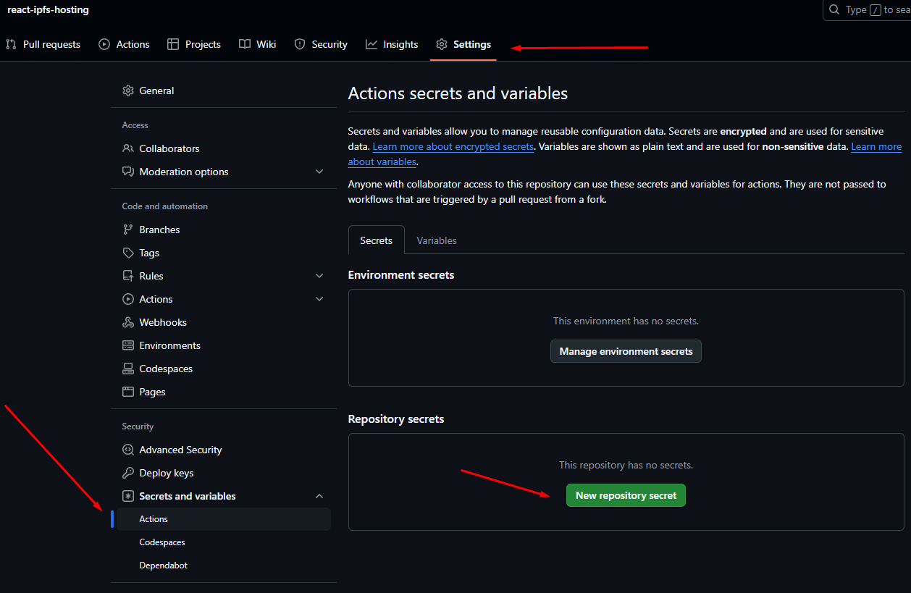
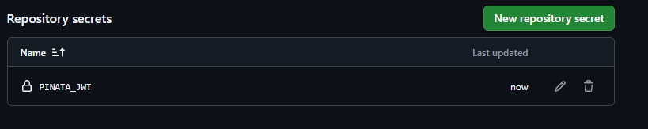
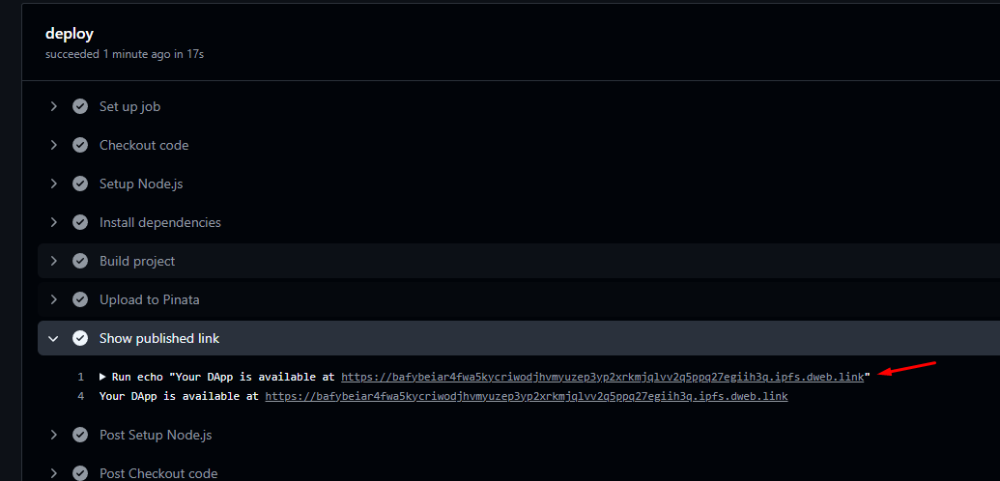

## 🔐 Motivation

In today's digital landscape, where censorship and surveillance are on the rise, it's vital to have tools for **free, censorship-resistant, and anonymous publishing**. This project enables anyone to publish content — whether it's text, manifestos, ideas, or whistleblower reports — **without revealing their identity or relying on centralized platforms**.

We use **IPFS** (via [Pinata](https://www.pinata.cloud/)) for hosting content in a decentralized and persistent way. To enhance anonymity, we recommend using a **privacy-focused email provider** like [Tuta.io](https://tuta.io), especially when registering for services like Pinata. While it's not strictly required, we use it in our examples as a best practice for maintaining anonymity.

This project is a response to growing restrictions on the free flow of information. It empowers users to share ideas **beyond the reach of censorship**, while maintaining **control over their identity and data**.

## Steps to host

1. Create an account in [Tuta](https://tuta.com/) for using in future
2. Register new account in [Pinata](https://pinata.cloud/) using our new e-mail
3. Need to generate a Pinata JWT Token for GitHub Actions. Go to **Developer** -> **API Keys** section and click **New Key**.
    Choose **pinFileToIPFS** and click **Create**. You will see **JWT** section, we need to Paste this JWT Token to the repository secrets with appropriate name PINATA_JWT 

## Coding requirements using React + Vite (if you don't want to fork this repository)

1. You need to set up your fonts in project locally
2. Install [ViteSingleFile](https://github.com/richardtallent/vite-plugin-singlefile) plugin and use it in **vite.config.ts** file
3. On new pull request created and changes pushed CI/CD actions will be applied. In **Actions** you will see new link for your website  

